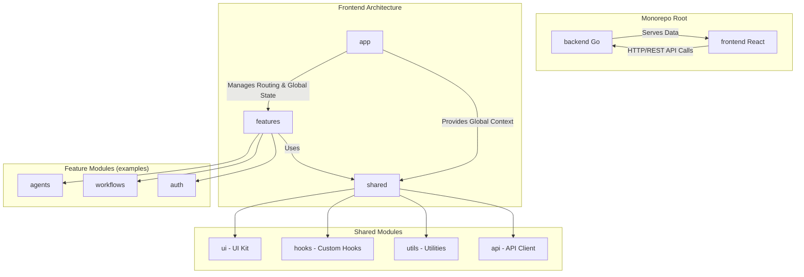

# 前端架构分析：Polyglot Monorepo

**meta.date:** 2025-11-19 12:48, 中国时区 (UTC+8)
**meta.author:** Codex 分析AI

## 1. 架构定义：Polyglot Monorepo

本项目将采用 **Polyglot Monorepo**（多语言单体仓库）架构。该模式的特点是在同一个代码仓库中管理多个使用不同技术栈的项目。具体到本项目，我们将在 `AgentFlowCreativeHub` 仓库中同时管理：

*   **后端 (Backend):** 使用 Go 语言实现。
*   **前端 (Frontend):** 使用 React (Vite) 技术栈。

这种模式的优势在于能够简化跨团队协作、统一构建与部署流程，并促进代码共享。

## 2. 架构权衡分析

在前端实现上，我们评估了以下三种主流方案：

| 方案 | 优点 | 缺点 | 适用场景 |
| :--- | :--- | :--- | :--- |
| **单体前端 (Monolith Frontend)** | 结构简单，易于上手和管理。 | 随着功能增加，代码库会变得臃肿，难以维护和扩展。 | 小型项目或项目初期。 |
| **模块化单体前端 (Modular Monolith Frontend)** | 在单体结构内按功能模块划分，兼顾了简单性和可扩展性。 | 模块间边界依赖约定，不如物理隔离清晰。 | 大多数中大型项目的理想起点。 |
| **微前端 (Micro-Frontends)** | 各团队可独立开发、部署和扩展，技术栈灵活。 | 架构复杂，增加了集成、路由和状态管理的难度。 | 拥有多个独立子系统的大型复杂应用。 |

**结论与建议：**

考虑到项目当前阶段，我们推荐采用 **模块化单-体前端 (Modular Monolith Frontend)** 方案。它在保持开发简便性的同时，为未来的功能扩展预留了空间。当项目复杂度显著增加时，可以平滑地演进到微前端架构。

## 3. 建议的目录结构

基于“模块化单体前端”的理念，我们提出以下目录结构：

```text
AgentFlowCreativeHub/
├── backend/          # Go 后端应用
├── frontend/         # React + Vite 前端应用
│   ├── public/
│   ├── src/
│   │   ├── app/      # 应用级配置 (路由、状态管理、全局样式)
│   │   ├── features/ # 核心功能模块 (按领域划分)
│   │   │   ├── agents/
│   │   │   ├── workflows/
│   │   │   └── auth/
│   │   ├── shared/   # 跨功能共享模块
│   │   │   ├── ui/     # 通用 UI 组件 (按钮, 输入框等)
│   │   │   ├── hooks/  # 自定义 Hooks
│   │   │   ├── utils/  # 工具函数
│   │   │   └── api/    # API 客户端与类型定义
│   │   └── main.tsx  # 应用入口
│   ├── package.json
│   ├── tsconfig.json
│   └── vite.config.ts
└── docker-compose.yml
```

**结构说明：**

*   **`features/`**: 按业务领域划分模块，每个模块内部高内聚，包含自己的组件、状态和逻辑。
*   **`shared/`**: 存放可被多个 `features` 复用的代码，例如 UI 组件库、工具函数和 API 定义。
*   **`app/`**: 负责整合所有模块，配置路由和全局状态。

## 4. 集成策略

为了确保前后端高效协作，我们将实施以下集成策略：

*   **统一构建脚本**: 使用 `Makefile` 或根目录的 `package.json` 脚本统一管理前后端的构建、测试和启动命令。
*   **共享 API 类型**:
    *   后端通过 OpenAPI (Swagger) 规范定义 API 接口。
    *   前端使用工具（如 `openapi-typescript-codegen`）基于该规范自动生成 TypeScript 类型和 API 客户端，确保前后端数据契约的一致性。
*   **CI/CD 流水线整合**: 在同一个 CI/CD 流水线中执行前后端的构建、测试和部署任务，简化发布流程。

此文档将作为后续前端实现的技术蓝图。

## 5. 架构可视化

为了更直观地展示模块之间的关系和数据流，以下是建议架构的 Mermaid 图表：



**图表说明:**

*   **Monorepo Root**: 展示了后端和前端在同一个仓库中的并列关系。
*   **Frontend Architecture**: 描述了 `app`, `features`, 和 `shared` 三个核心目录之间的依赖关系。`app` 是应用的顶层协调者，`features` 实现具体的业务功能，而 `shared` 提供可复用的能力。
*   **Data Flow**: `Frontend` 通过 `HTTP/REST API` 与 `Backend` 进行通信，实现了前后端分离。